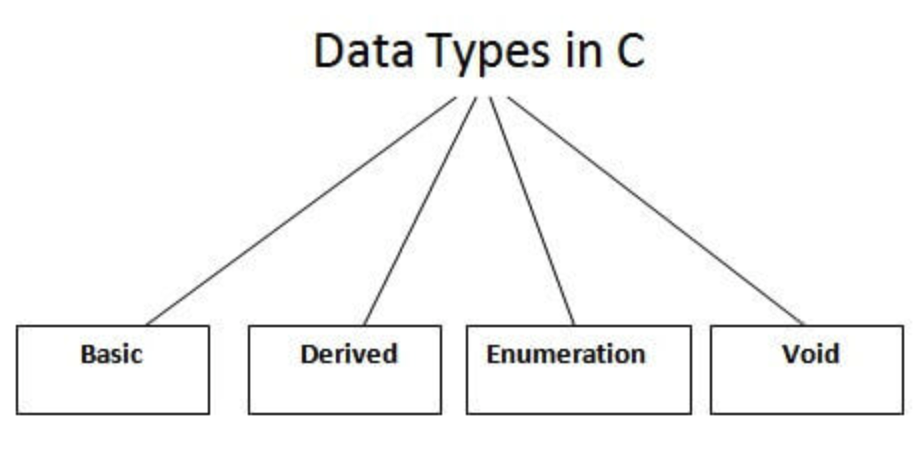

## C Programming Language

### Table Content
- [Introduction](https://github.com/fateh22/C-C-Programing#introduction)
- [Data Types in C](https://github.com/fateh22/C-C-Programing#data-types-in-c)

### Introduction
C is considered as a middle-level language because it **supports the feature of both low-level and high-level languages**. C language program is converted into assembly code, it supports pointer arithmetic (low-level), but it is machine independent (a feature of high-level).

A **Low-level language** is specific to one machine, i.e., machine dependent. It is machine dependent, fast to run. But it is not easy to understand.

A **High-Level language** is not specific to one machine, i.e., machine independent. It is easy to understand.

The C Language is developed by **Dennis Ritchie** for creating system applications that directly interact with the hardware devices such as drivers, kernels, etc.

### Data Types in C
A data type specifies the type of data that a variable can store such as integer, floating, character, etc.


Types | Data Types
 ------------ | -------------
Basic Data Type | int, char, float, double
Derived Data Type | array, pointer, structure, union
Enumeration Data Type | enum
Void Data Type	| void

Let's see the basic data types. Its size is given according to 32-bit architecture.

Data Types | Memory Size	 | Range
 ------------ | -------------  | --------------
 char |	1 byte | −128 to 127
 signed char |	1 byte |	−128 to 127
 unsigned char |	1 byte |	0 to 255
short	| 2 byte |	−32,768 to 32,767
signed short	| 2 byte |	−32,768 to 32,767
unsigned short	| 2 byte |	0 to 65,535
int	| 2 byte |	−32,768 to 32,767
signed int	| 2 byte | 	−32,768 to 32,767
unsigned int | 2 byte |	0 to 65,535
short int	| 2 byte |	−32,768 to 32,767
signed short int	| 2 byte |	−32,768 to 32,767
unsigned short int	| 2 byte |	0 to 65,535
long int	| 4 byte | -2,147,483,648 to 2,147,483,647
signed long int	| 4 byte | 	-2,147,483,648 to 2,147,483,647
unsigned long int	| 4 byte | 0 to 4,294,967,295
float	| 4 byte
double	| 8 byte
long double	| 10 byte
Basic Data Type | int, char, float, double
Derived Data Type | array, pointer, structure, union
Enumeration Data Type | enum
Void Data Type	| void


### C Compiling file
```
cc program1.c -o bin/output
./bin/output
```

### C++ Compiling file
```
g++ cpp/customer.cpp -o bin/customer
./bin/customer
```
